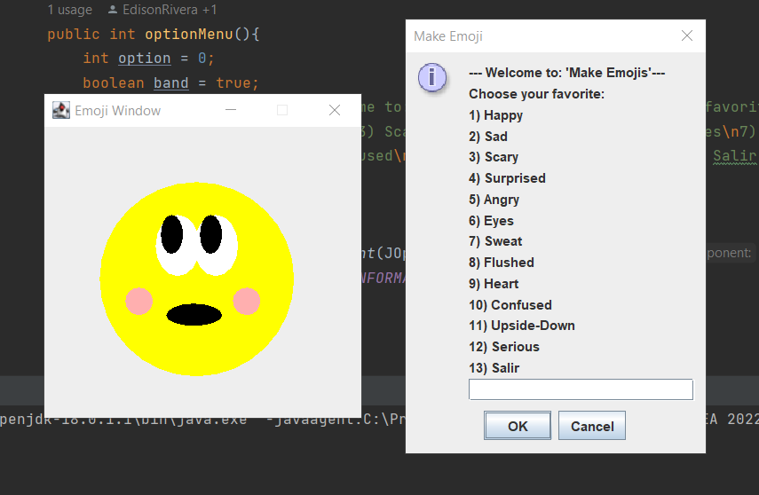
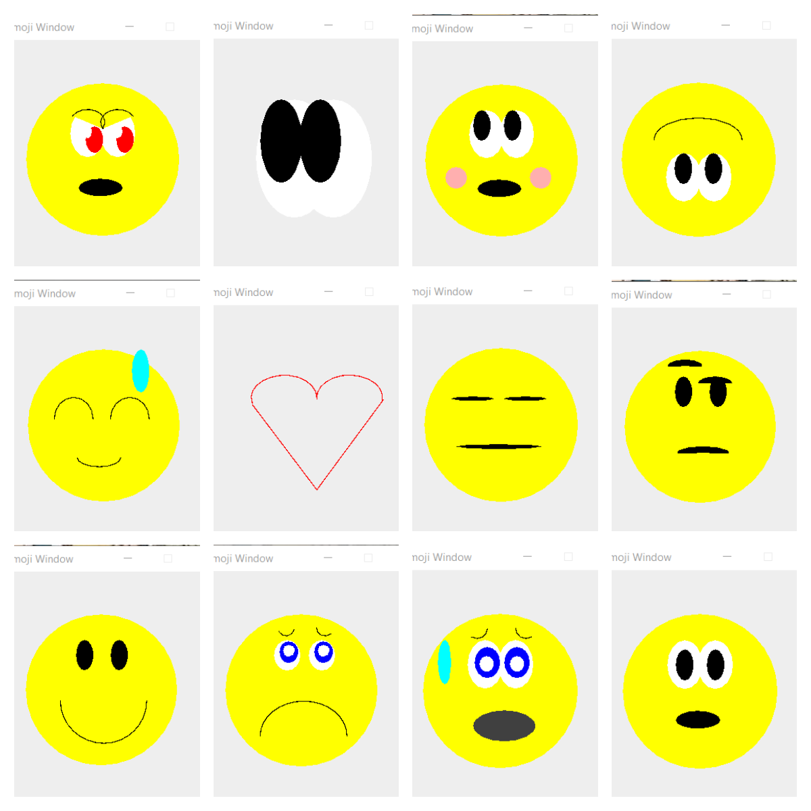
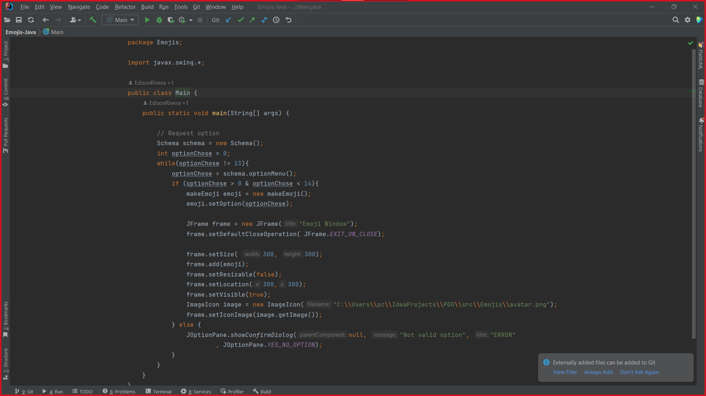
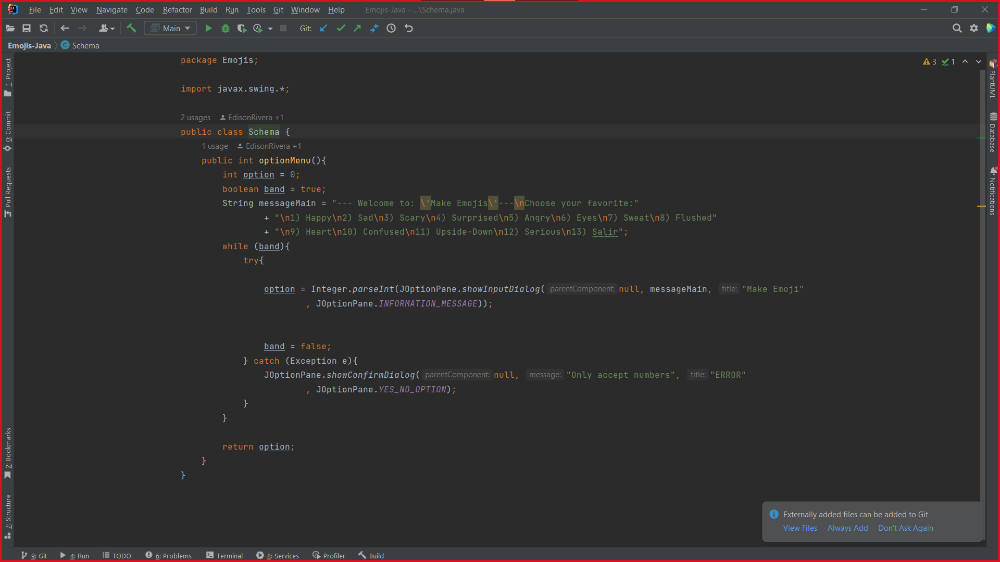
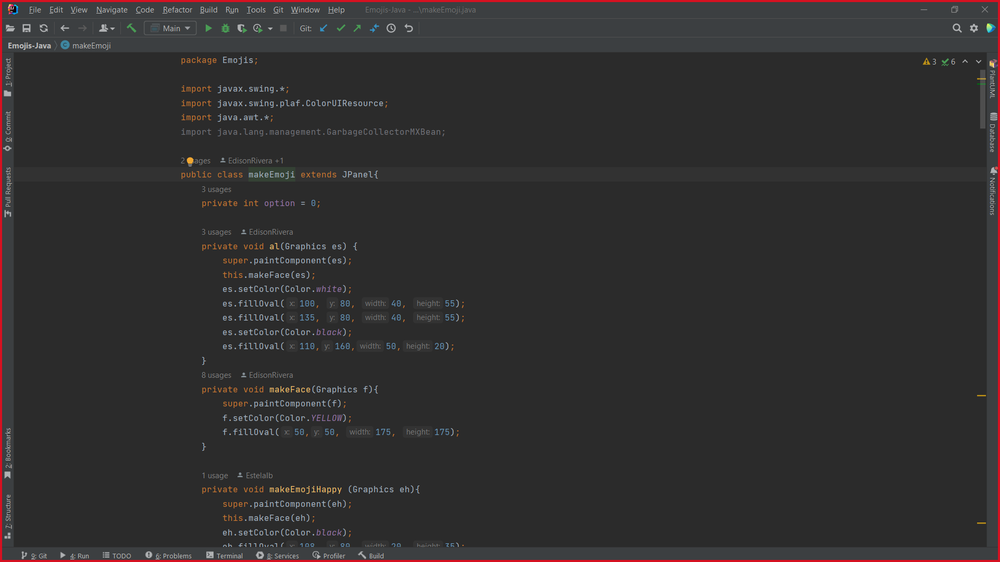

# Make Emojis in Java 😎😝🤑
### Members: **Estela Chipantasi** - **Edison Rivera**
***
### 📙 **Intructions:**
1. Enter the option do you like **in range 1 to 13**

+ The emoji window only show the chosen emoji, you **cannot close this window**.
### **Collection of all emojis** 

***

## **Code of the Project** 👩‍💻👨‍💻
1. Code of: **`Main.java`**

2. Code of: **`Schema.java`**

3. Code of: **`makeEmojis.java`**
